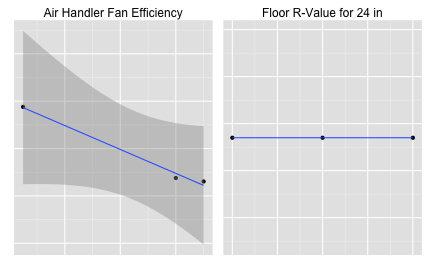

---
output:
  knitrBootstrap::bootstrap_document:
    theme: Spacelab
    highlight: Sunburst
    theme.chooser: FALSE
    highlight.chooser: FALSE
    menu: FALSE
---

# Asset Score Preflight Analysis

This document contains the high level results of the preflight simulation analysis conducted.  The analysis looks at taking the min, max, and expected value (mean) of each input variable independent of the other variables. This allows the person conducting the analysis to get an understanding on the potential impact (sensitivity) of the variable as a function of the output.  Note that the variables are evaluated independently, meaning that if the interaction of two variables has an impact on the output then they won't be evaluated in this context (e.g. daylighting and skylights).  

The results are show in various tables and plots.  The example plot below shows a quick 'linear regression' on the 3 data points that were run.  The `x` axis is the variable of interest and the `y` axis the output of the building metric of interest (typically Total Source Energy, Total Electricity, or Total Natural Gas). The plots are designed to be eye-charts and provide a quick visual on the importance of each variable. A horizontal line would denote no output change. Lines with high slopes denote variables that change the output significantly. In many cases there are no plots, meaning that the variable was not evaluated in the analysis because the variable most likely did not exist in the base line model (e.g. heatpump efficiencies when the building has a central chiller). Clicking on the header of a column of data in a table will sort the table by that variable. Clicking again will sort the data in the oposite order.



```{r setup, echo=FALSE, include=FALSE}

# methods for compiling knitr
options(rstudio.markdownToHTML = function(inputFile, outputFile) {
    require(knitrBootstrap)
    knit_bootstrap_md(input=inputFile, output=outputFile)
  }
)

# set global chunk options
require(knitr)
require(ggplot2)
require(AlgDesign)
require(grid)
opts_chunk$set(warning=F, message=F)
opts_knit$set(eval.after='fig.cap')
torcap <- function () {
    p <- last_plot()
    if (!is.null(p)) {
        paste('Figure: ',resultlistd[j],' Use Range for One-At-a-Time (OAT) Simulation of the ',buildings$building_display_name[b],' Building Type',sep="")
    } else {
        NULL # null caption
    }
}
gridcap <- function () {
    p <- last_plot()
    if (!is.null(p)) {
        paste('Figure: Impact of Variables on the ',resultlistd[j],' Use of the Simulated ',buildings$building_display_name[b],' Building',sep="")
    } else {
        NULL # null caption
    }
}
```

## Variables

The variables for all the preflight simulations are listed below.  You can navigate to a specific building using the navigation on the left.

```{r echo=F}
wd_base = '.'
# include the list of variables from just one of the dataframes before going into building-by-building results
initializing_files = dir(paste(wd_base,"data",sep="/"))
initializing_files=initializing_files[grepl("_metadata.RData",initializing_files)]

load(paste(wd_base,"data",initializing_files[1],sep="/"))
variables_df = metadata

# Read each of the variables
pivots = subset(variables_df, type_of_variable=='pivot')
vs = subset(variables_df, type_of_variable=='variable')
```

Summary of input variables for all buildings
* There is/are `r nrow(pivots)` pivot variables
* There are `r nrow(vs)` variables

```{r echo=F, results='asis', fig.align='center'}
vs_p = vs[c('display_name','units','value_type')]
colnames(vs_p) = c("Variable","Units","Type")
kable(vs_p, format = "markdown", row.names=F)
```

```{r echo=F}
# import 'reporting_outputs.csv'
desired_results = read.csv(paste(wd_base,"/resources/reporting_outputs.csv",sep=""))
resultlist = NULL
resultlistd = NULL
for(i in 1:nrow(desired_results["resultlist"])){
  resultlist = c(resultlist,toString(desired_results[i,"resultlist"]))
  resultlistd = c(resultlistd,toString(desired_results[i,"resultlistd"]))
}

# check resultlist and resultlistd
if(length(resultlist)!=length(resultlistd)){
  stop("Please enter the same number of result names and result display names.")
}

# get result units
resultunits=NULL
for(i in 1:length(resultlist)){
  resultunits = c(resultunits,variables_df[which(variables_df$name == resultlist[1]),"units"])
}

# import building types
buildings = read.csv(paste(wd_base,"/resources/buildings.csv",sep=""))
buildings = buildings[order(buildings[,'building_name']),]
# initialize the preflight output dataframe
```

```{r include=F, error=T, message=T}
out = NULL
b = 1
for(b in 1:nrow(buildings)){
  out = c(out, paste("##",buildings$building_display_name[b]))
  load(paste(buildings$results_dataframe[b]))
  project_name = buildings$building_name[b]
  preflight_df = results
  out = c(out, knit_child('building.Rmd'))  
}
```

`r paste(out, collapse='\n')`